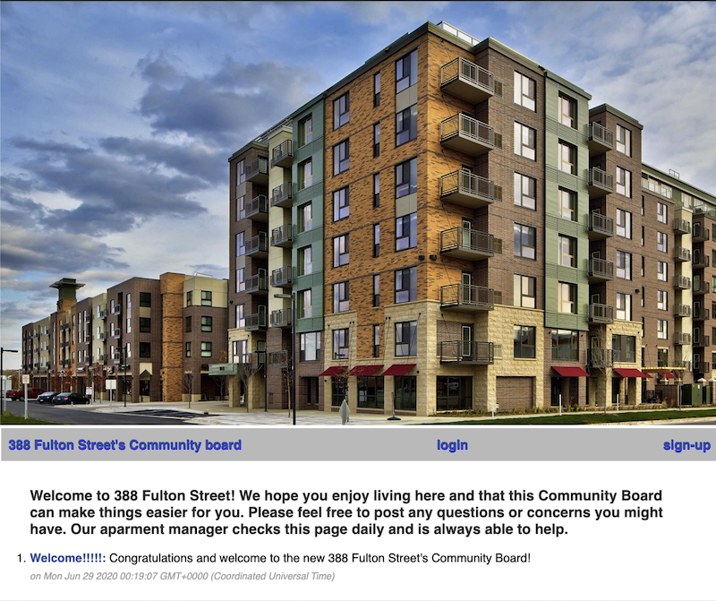
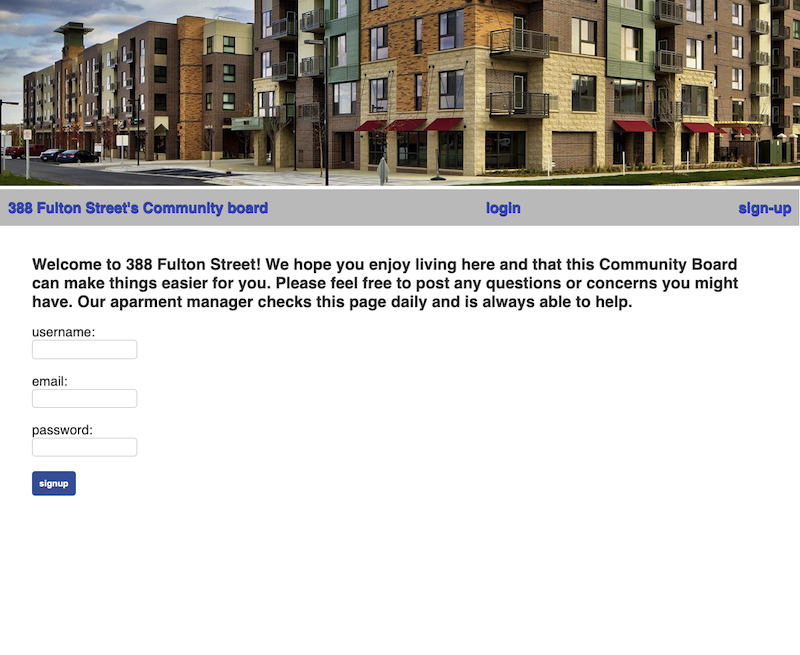
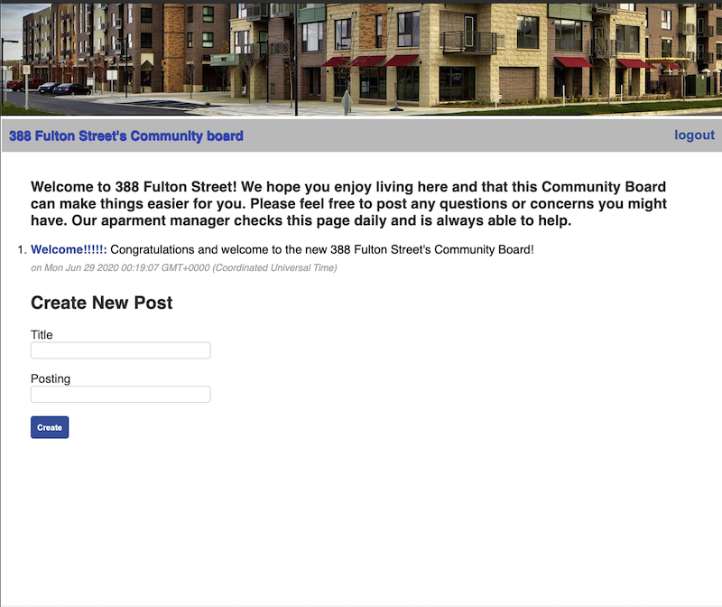

#  3__ Fulton Street's Community Board
## UCBExt Project 2

An apartment’s bulletin board for tenants to log into, communicate with each other, and see any building notifications.  

Deployed Application: https://afternoon-cove-63197.herokuapp.com/

## Concept:
A community page for tenants to share.  We believe a community bulletin board could use all the recent technologies we’ve been learning. 

## User Story:
As a tenant I want a local, community page I can log into to talk with neighbors and know any building updates. 

## Technologies Used:
    - Express.js            - Node.js       - Heroku         - Handlebars.js
    - Sequelize             - MySQL         - Sequelize      - Dotenv
    - Express-handlebars    -Express-session

